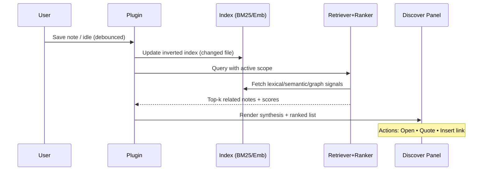
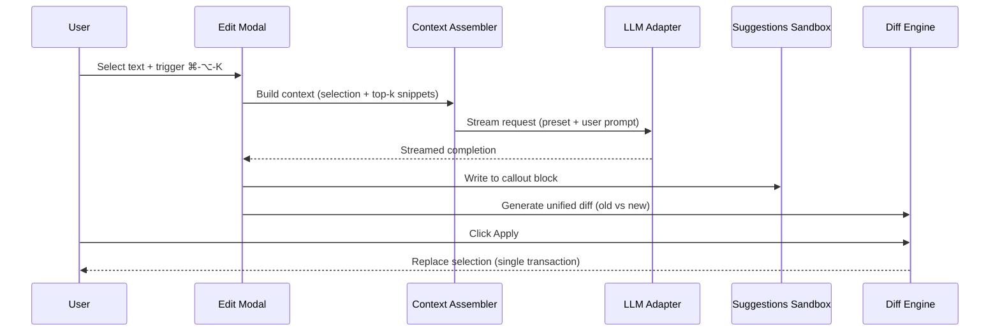

# VaultPilot — Architecture & Data Flow

> High-level view of how the plugin indexes notes, retrieves/ranks context, calls the LLM, and writes safe suggestions.

## 1) Component Diagram
```mermaid
flowchart LR
  subgraph UI[UI Components]
    DP[Discover Panel]
    EM[Edit Modal]
    SD[Chat Drawer]
    SS[Suggestions Sandbox]
  end

  subgraph Core[Core Logic]
    SC[Scope Resolver]
    RT[Retriever]
    RK[Ranker]
    CA[Context Assembler]
    DF[Diff Engine]
  end

  subgraph Indexing[Index & Cache]
    BM[BM25 Index]
    EMBD[Embeddings Cache]
    MD[Metadata Cache (links,tags)]
  end

  subgraph IO[Adapters & Storage]
    LLM[LLM Adapter (OpenAI/Claude/Ollama)]
    ST[Plugin Data (settings, scopes)]
  end

  DP --> SC --> RT --> RK --> CA --> DP
  EM --> CA --> LLM --> SS --> DF
  SD --> CA --> LLM --> SD

  RT <--> BM
  RT <--> EMBD
  RT <--> MD
  SC --> ST
```

## 2) Discover Flow (on save / idle)


## 3) Inline Edit with AI (⌘‑⌥‑K)


## 4) Scope Resolution
- Inputs: Selection, current file, folder(s), tag(s), backlinks, pinned notes.
- Saved as named profiles in plugin data; used by Discover and Chat Drawer.
- Respects frontmatter exclusions: `ai.index: false`.

## 5) Ranking Blend (example weights)
```text
score = 0.6*bm25 + 0.2*semantic + 0.15*(1.0*backlinks + 0.6*shared_tags + 0.4*same_folder) + 0.05*recency
```

## 6) Error & Cancellation
- All long ops cancellable; UI shows spinner + cancel.
- On error, fallback to BM25-only; show toast but keep UI usable.
- Writes are additive; never overwrite user content directly.

## 7) Security & Privacy
- **Local-only mode**: no external calls; semantic disabled unless local.
- **Remote mode**: active provider/model visibly shown; per-note opt-out (`ai.index: false`).

## 8) Files & Storage
- Plugin data JSON: settings, named scopes, analytics (opt-in).
- Cache folders: BM25 index, embeddings (by content hash).
- No content leaves device in Local-only.
